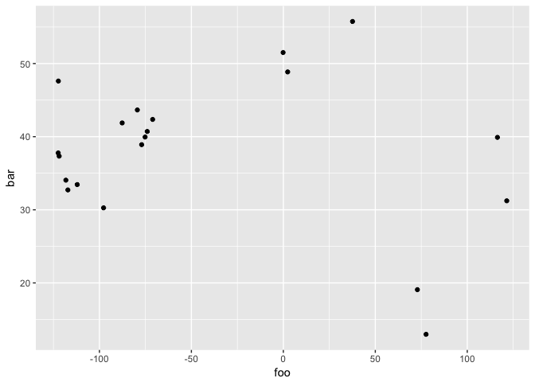
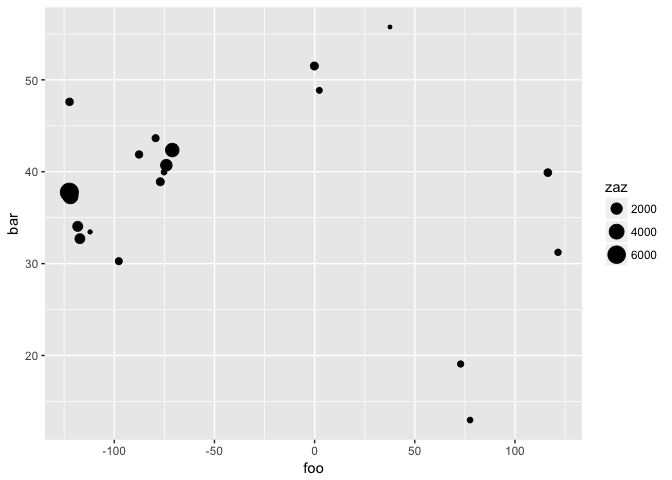
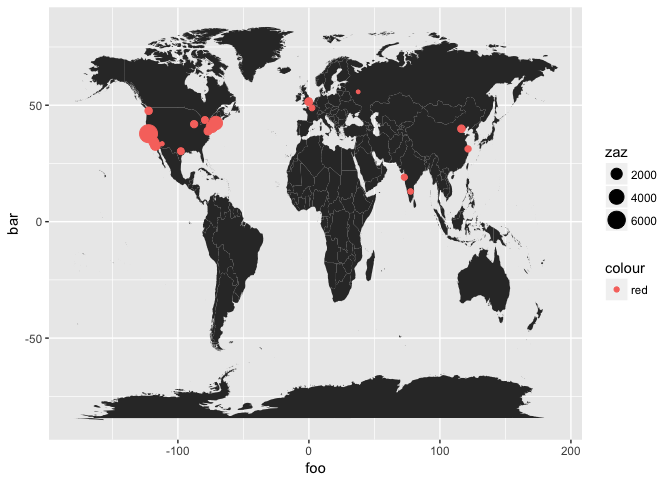
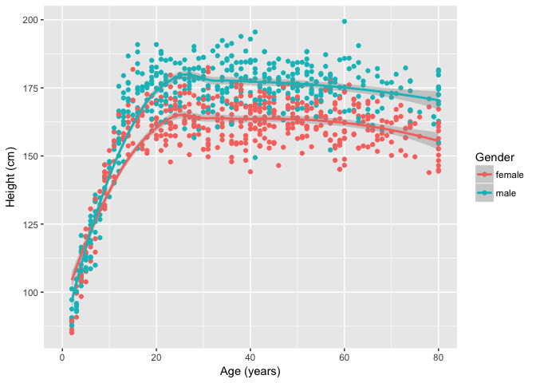

# _Before We Begin_

Make sure that the following packages are installed from CRAN:

* `choroplethrMaps`
* `DiagrammeR`
* `maps`
* `NHANES`

As we go along, we will load these, but for now make sure they are installed.

## Markdown Document Begins

Let's look at your "environment" at the beginning of the R Markdown document (RMD). One way to do this is to see what your current `sessionInfo()` is at first. Notice especially, what packages are NOT loaded.

Also let's see what the RMD file "sees" in your "Global Environment" - this question is itself incorrect, since when the "KNIT" process begins a new "environment" is actually created with an empty data space (no objects), which is why no packages beyond those in base R are available. We'll run the `ls()` command to "list" the objects that the RMD file can "see" along the steps below.


```r
sessionInfo()
```

```
## R version 3.4.3 (2017-11-30)
## Platform: x86_64-apple-darwin15.6.0 (64-bit)
## Running under: macOS Sierra 10.12.6
## 
## Matrix products: default
## BLAS: /Library/Frameworks/R.framework/Versions/3.4/Resources/lib/libRblas.0.dylib
## LAPACK: /Library/Frameworks/R.framework/Versions/3.4/Resources/lib/libRlapack.dylib
## 
## locale:
## [1] en_US.UTF-8/en_US.UTF-8/en_US.UTF-8/C/en_US.UTF-8/en_US.UTF-8
## 
## attached base packages:
## [1] stats     graphics  grDevices utils     datasets  methods   base     
## 
## loaded via a namespace (and not attached):
##  [1] compiler_3.4.3  backports_1.1.2 magrittr_1.5    rprojroot_1.3-2
##  [5] tools_3.4.3     htmltools_0.3.6 yaml_2.1.16     Rcpp_0.12.15   
##  [9] stringi_1.1.6   rmarkdown_1.8   knitr_1.19      stringr_1.2.0  
## [13] digest_0.6.15   evaluate_0.10.1
```

```r
ls()
```

```
## character(0)
```

Notice that there are 4 parts to the `sessionInfo()` output:

* the R software version and platform details
* the "locale" information about English language and location in the United States
* a list of the "attached base packages" - these are the ones that are loaded with base R
* and a list of packages (so far) "loaded via namespace (and not attached)" to understand this better see this short demo at "Stack Overflow" [http://stackoverflow.com/questions/14988722/in-r-what-does-loaded-via-a-namespace-and-not-attached-mean](http://stackoverflow.com/questions/14988722/in-r-what-does-loaded-via-a-namespace-and-not-attached-mean). Basically, you can't call functions in these packages directly, instead you have to use the format `package::function()` to call the functions in these packages.

## Your RMD "Session" and "Environment"

Let's load the packages we need and run the `sessionInfo()` command again and compare to what we saw above. We'll run the `ls()` command again for completeness but we haven't created any objects yet so this is still empty.

Let's "load" `tidyverse` and `ggplot2` and see how this impacts the `sessionInfo()`.


```r
library(tidyverse)
```

```
## ── Attaching packages ────────────────────────────────── tidyverse 1.2.1 ──
```

```
## ✔ ggplot2 2.2.1     ✔ purrr   0.2.4
## ✔ tibble  1.4.2     ✔ dplyr   0.7.4
## ✔ tidyr   0.8.0     ✔ stringr 1.2.0
## ✔ readr   1.1.1     ✔ forcats 0.2.0
```

```
## ── Conflicts ───────────────────────────────────── tidyverse_conflicts() ──
## ✖ dplyr::filter() masks stats::filter()
## ✖ dplyr::lag()    masks stats::lag()
```

```r
library(ggplot2)
sessionInfo()
```

```
## R version 3.4.3 (2017-11-30)
## Platform: x86_64-apple-darwin15.6.0 (64-bit)
## Running under: macOS Sierra 10.12.6
## 
## Matrix products: default
## BLAS: /Library/Frameworks/R.framework/Versions/3.4/Resources/lib/libRblas.0.dylib
## LAPACK: /Library/Frameworks/R.framework/Versions/3.4/Resources/lib/libRlapack.dylib
## 
## locale:
## [1] en_US.UTF-8/en_US.UTF-8/en_US.UTF-8/C/en_US.UTF-8/en_US.UTF-8
## 
## attached base packages:
## [1] stats     graphics  grDevices utils     datasets  methods   base     
## 
## other attached packages:
## [1] forcats_0.2.0   stringr_1.2.0   dplyr_0.7.4     purrr_0.2.4    
## [5] readr_1.1.1     tidyr_0.8.0     tibble_1.4.2    ggplot2_2.2.1  
## [9] tidyverse_1.2.1
## 
## loaded via a namespace (and not attached):
##  [1] Rcpp_0.12.15     cellranger_1.1.0 pillar_1.1.0     compiler_3.4.3  
##  [5] plyr_1.8.4       bindr_0.1        tools_3.4.3      digest_0.6.15   
##  [9] lubridate_1.7.2  jsonlite_1.5     evaluate_0.10.1  nlme_3.1-131    
## [13] gtable_0.2.0     lattice_0.20-35  pkgconfig_2.0.1  rlang_0.1.6     
## [17] psych_1.7.8      cli_1.0.0        rstudioapi_0.7   yaml_2.1.16     
## [21] parallel_3.4.3   haven_1.1.1      bindrcpp_0.2     xml2_1.2.0      
## [25] httr_1.3.1       knitr_1.19       hms_0.4.1        rprojroot_1.3-2 
## [29] grid_3.4.3       glue_1.2.0       R6_2.2.2         readxl_1.0.0    
## [33] foreign_0.8-69   rmarkdown_1.8    modelr_0.1.1     reshape2_1.4.3  
## [37] magrittr_1.5     backports_1.1.2  scales_0.5.0     htmltools_0.3.6 
## [41] rvest_0.3.2      assertthat_0.2.0 mnormt_1.5-5     colorspace_1.3-2
## [45] stringi_1.1.6    lazyeval_0.2.1   munsell_0.4.3    broom_0.4.3     
## [49] crayon_1.3.4
```

```r
ls()
```

```
## character(0)
```

Now you get a 5th category in the `sessionInfo()` listing "other attached packages". So, you can now see that by loading `tidyverse` we have greatly expanded the functionality now available. `tidyverse` has now added:

* `dplyr`
* `purrr`
* `readr`
* `tidyr`
* `tibble`
* `ggplot`
* `tidyverse`

So, these packages (above) do not have to be loaded again.

However, `tidyverse` does load more packages by "namespace" but these (below) have to called using the `package::function()` syntax:

* `assertthat`
* `R6`
* `grid`
* `DBI`
* `gtable`
* `scales`
* `lazyeval`
* `munsell`
* `colorspace`

_NOTE: In general, it is a good idea to go ahead and use the `package::function()` syntax so that someone reading your code in the future will know at a glance what packages are needed for your code to work._

## Load Data

One of the datasets we are going to work with today is data from the EPA in which counties across the US reported the average amounts of pesticides used in that year by pesticide type.

First let's read in the "Pesticides.csv" and "ag-dict.csv" datasets using `read_csv()` from the `readr` package loaded as part of the `tidyverse`. Notice that when we look at the Pesticides data using `head()` R says it is a "tibble" - this is also a result of using the `tidyverse`.

AND let's run `ls()` again so you see that we now have 2 objects in our "environment" that the RMD file can "see":

* `Pesticides` and
* `ag_dict`


```r
# read in the pesticide dataset
Pesticides <- read_csv("Pesticides.csv")
```

```
## Parsed with column specification:
## cols(
##   COMPOUND = col_character(),
##   YEAR = col_integer(),
##   STATE_CODE = col_integer(),
##   COUNTY_CODE = col_integer(),
##   LOW_ESTIMATE = col_double(),
##   HIGH_ESTIMATE = col_double()
## )
```

```r
# look at head() of dataset
# notice it is listed as a "tibble"
# this is from tidyverse
head(Pesticides)
```

```
## # A tibble: 6 x 6
##   COMPOUND  YEAR STATE_CODE COUNTY_CODE LOW_ESTIMATE HIGH_ESTIMATE
##   <chr>    <int>      <int>       <int>        <dbl>         <dbl>
## 1 2_4_D     2014          1           1         1699          1886
## 2 2_4_D     2014          1           3         7514          8472
## 3 2_4_D     2014          1           5         2614          2889
## 4 2_4_D     2014          1           7         1259          1278
## 5 2_4_D     2014          1           9         7590          7756
## 6 2_4_D     2014          1          11         1319          1408
```

```r
# read in the links to county and state names
ag_dict <- read_csv("ag-dict.csv")
```

```
## Parsed with column specification:
## cols(
##   STATE_CODE = col_integer(),
##   COUNTY_CODE = col_integer(),
##   COUNTY = col_character(),
##   STATE = col_character()
## )
```

```r
ls()
```

```
## [1] "ag_dict"    "Pesticides"
```

## Summary of the Data

Let's run a `summary()` of the variables in the Pesticides dataset:


```r
summary(Pesticides)
```

```
##    COMPOUND              YEAR        STATE_CODE     COUNTY_CODE   
##  Length:392433      Min.   :2014   Min.   : 1.00   Min.   :  1.0  
##  Class :character   1st Qu.:2014   1st Qu.:19.00   1st Qu.: 35.0  
##  Mode  :character   Median :2014   Median :29.00   Median : 77.0  
##                     Mean   :2014   Mean   :30.73   Mean   : 94.6  
##                     3rd Qu.:2014   3rd Qu.:45.00   3rd Qu.:129.0  
##                     Max.   :2014   Max.   :56.00   Max.   :810.0  
##                                                                   
##   LOW_ESTIMATE     HIGH_ESTIMATE    
##  Min.   :      0   Min.   :      0  
##  1st Qu.:      1   1st Qu.:      2  
##  Median :     12   Median :     16  
##  Mean   :   1534   Mean   :   1225  
##  3rd Qu.:    134   3rd Qu.:    142  
##  Max.   :5507146   Max.   :5507146  
##  NA's   :119027
```

This dataset is estimated amounts of different pesticides (388 compounds) applied in 2014 **by county** and **by state**. 

## Compute a new variable

The variables LOW_ESTIMATE and HIGH_ESTIMATE are estimated amounts of the pesticide named in that row applied in that county of that state in 2014. Let's **create a new variable**, the average estimate and get a summary.


```r
Pesticides$AVG_ESTIMATE <- 
  (Pesticides$LOW_ESTIMATE + Pesticides$HIGH_ESTIMATE)/2

summary(Pesticides$AVG_ESTIMATE)
```

```
##    Min. 1st Qu.  Median    Mean 3rd Qu.    Max.    NA's 
##       0       2      22    1598     190 5507146  119027
```

We are going to be interested in counties in Florida and Georgia because the School of Nursing has service and research projects in the migrant farmworker communities in both states. 

In particular, the Girasoles (Sunflower) study is assessing the health of agricultural workers in Florida (STATE_CODE 12). The cities where we have worked to date are Pierson, Apopka, Immokalee, and Felsmere, which are located in Volusia, Orange, Collier, and Indian River Counties respectively. The county codes are 127, 945, 21, and 61 respectively. Also the Heat-related Illness, Adaptation, the Microbiome, and Inflammation (HIAMI) study is examing biological samples taken from agriculatural workers in the area served by the farmworker health clinic in Ellenton, Georgia (STATE_CODE 13). This area comprises Brooks, Colquitt, Cook, and Tift counties for which the county codes are 27, 71, 75, and 277, respectively.


## The "Grammar" of Data Wrangling


Today we are talking a bit more about the `grammars` of R, specifically, the grammar of graphics, and the grammar of data wrangling.

That brilliant rascal, Hadley Wickham, is responsible for both of these grammars. 

First, the grammar of data wrangling (or More with `dplyr` from `tidyverse`).

There are five "verbs" for data wrangling. These are as follows:

- `select()` 
    + This will take a subset of columns (i.e., features or variables)
- `filter()`
    + This will take a subset of rows (i.e., observations)
- `mutate()`
    + This will add or modify existing columns
- `arrange()`
    + This will sort the rows
- `summarize()` 
    + This will aggregate data across rows (e.g., group it according to some criteria)

Each of these functions takes a data frame as its first argument, and returns a data frame. So these are pretty powerful functions, allowing you to slice and dice your way through a data table. 

It is said that Hadley Wickham created these "verbs" in an inspiration to blur the boundaries between R and SQL, a relational database querying language. 

## Subsetting data - selecting the columns or rows you want

The two simplest of these commands are `select()` and `filter()`. These allow you to return only a subset of columns or rows in a data frame. 

To demonstrate, let's grab the chunk of the dataset that is only the pesticide Atrazine applied in the state of Florida. We already know that Florida has STATE_CODE of 12, so first let's just grab the columns we want, COMPOUND, STATE_CODE, and AVG_ESTIMATE (i.e. keep 3 columns). We can use the `dim()` command to get the number of rows and columns for each new data object created.


```r
# dplyr::select() selects columns you want to keep
pesticide_subset <- select(Pesticides, 
                           COMPOUND, 
                           STATE_CODE, 
                           AVG_ESTIMATE)
dim(pesticide_subset)
```

```
## [1] 392433      3
```

Now let's get Florida only (keep only the rows for Florida):


```r
# dplyr::filter() selects the rows you want
# notice we are using a LOGICAL argument
# STATE_CODE == 12 as our filter
FL_subset <- filter(pesticide_subset, 
                    STATE_CODE == 12)
dim(FL_subset)
```

```
## [1] 9167    3
```

And now let's get Atrazine only rows:


```r
FL_Atrazine <- filter(FL_subset, 
                      COMPOUND == "Atrazine")
dim(FL_Atrazine)
```

```
## [1] 60  3
```

## EXERCISE FOR YOU TO TRY

Why don't you try this with data from the state of Georgia (with state code 13)? Specifically, the governor is interested in the amount of glyphosate (aka "Round-up") applied in 2014. How would you do this? Fill in the following R chunk. In this case, look for COMPOUND with name "Glyphosate" with a capital "G".


```r
# TRY IN CLASS
```

## A better way - Using pipes `%>%`

Note that in the way that we have sequenced these operations, the `filter()` operation is *nested* within the `select()` operation. We could just as easily reversed the order, nesting `select()` within `filter()`. Another way to think of this maneuver is that these operations are "chained" together in a "pipeline". The symbol for "piping"is `%>%`, in which the value returned from the first operation is the input for the second operation, etc.

For instance, instead of 3 different steps above, we can do this in effectively one line of code as follows shown below. This can be read as "take the Pesticides dataset" THEN select 3 variables (columns) THEN filter out only the cases (rows) for Florida (STATE_CODE=12) and Atrazine (COMPOUND).


```r
FL_Atrazine_new <- Pesticides %>% 
  select(COMPOUND, STATE_CODE, AVG_ESTIMATE) %>%
  filter(STATE_CODE == 12 & COMPOUND == "Atrazine")

# run summary of this data
summary(FL_Atrazine_new$AVG_ESTIMATE)
```

```
##     Min.  1st Qu.   Median     Mean  3rd Qu.     Max. 
##      0.5     84.2    399.6  10695.9   1164.0 447108.6
```
 
## Let's make a histogram of Atrazine Use in FL in 2014

Let's make a histogram of the Atrazine Use in FL during 2014. 

As we make this plot - we'll walk through the "Grammar of Graphics" `ggplot2` syntax and layering approach to building a plot/graphic.

### Step 1 - initialize the graphical environment


```r
ggplot(data=FL_Atrazine_new)
```

<!-- -->

### Step 2 - add a "geom" geometric object for histogram

As we saw looking at the summary stats above, the data is really skewed with some possible outliers (really high levels). So, we'll use a `log10()` transform of the data to help "normalize" the levels. NOTE: The minimum value was small but was > 0. Remember log(0) is not a number so if you have true 0's in your data do not use a log-transform.


```r
ggplot(data=FL_Atrazine_new) +
  geom_histogram(aes(log10(AVG_ESTIMATE)))
```

```
## `stat_bin()` using `bins = 30`. Pick better value with `binwidth`.
```

<!-- -->

### Step 3 - add a title


```r
ggplot(data=FL_Atrazine_new) +
  geom_histogram(aes(log10(AVG_ESTIMATE))) +
  ggtitle("Atrazine Levels Used in FL During 2014")
```

```
## `stat_bin()` using `bins = 30`. Pick better value with `binwidth`.
```

<!-- -->

```r
# we could also do this using pipes %>%
FL_Atrazine_new %>%
  ggplot() + 
  geom_histogram(aes(log10(AVG_ESTIMATE))) +
  ggtitle("Atrazine Levels Used in FL During 2014")
```

```
## `stat_bin()` using `bins = 30`. Pick better value with `binwidth`.
```

<!-- -->

### Suppose we put it all into 1 long process

Most of the above code could be condensed using pipes `%>%`. The biggest advantage is you can easily see how we started with the original Pesticides dataset, selected variables of interest, filtered out the rows we wanted, and then made a histogram using the `ggplot2` approach.


```r
# we could actually do all of the 
# multiple code steps above using pipes %>%

Pesticides %>% 
  select(COMPOUND, STATE_CODE, AVG_ESTIMATE) %>%
  filter(STATE_CODE == 12 & COMPOUND == "Atrazine") %>%
  ggplot() + 
  geom_histogram(aes(log10(AVG_ESTIMATE))) +
  ggtitle("Atrazine Levels Used in FL During 2014")
```

```
## `stat_bin()` using `bins = 30`. Pick better value with `binwidth`.
```

<!-- -->

## EXERCISE FOR YOU TO TRY 
 
Let's modify the code above for Georgia's (STATE_CODE 13) use of Glyphosate (remember to captialize the "G") - show the histogram.


```r
Pesticides %>% 
  select(COMPOUND, STATE_CODE, AVG_ESTIMATE) %>%
  filter(STATE_CODE == 13 & COMPOUND == "Glyphosate") %>%
  ggplot() + 
  geom_histogram(aes(log10(AVG_ESTIMATE))) +
  ggtitle("Glyphosate Levels Used in GA During 2014")
```

```
## `stat_bin()` using `bins = 30`. Pick better value with `binwidth`.
```

```
## Warning: Removed 2 rows containing non-finite values (stat_bin).
```

<!-- -->

## Modifying the data object - `rename` and `mutate`

The `mutate()` and `rename()` functions allow us to cerate, redefine, and rename our variables. 

When we created the new variable AVG_ESTIMATE above, we could have used `mutate()` to create and append a new variable to the Pesticides dataset (thus "mutating" it from its original form).


```r
# the option is to do this with the
# dplyr package mutate() function
# and the %>% "pipe" option also available
# in the dplyr package which imports
# the magrittr package
Pesticides <- Pesticides %>%
  mutate(AVG_ESTIMATE = (LOW_ESTIMATE+HIGH_ESTIMATE)/2)
         
summary(Pesticides)  
```

```
##    COMPOUND              YEAR        STATE_CODE     COUNTY_CODE   
##  Length:392433      Min.   :2014   Min.   : 1.00   Min.   :  1.0  
##  Class :character   1st Qu.:2014   1st Qu.:19.00   1st Qu.: 35.0  
##  Mode  :character   Median :2014   Median :29.00   Median : 77.0  
##                     Mean   :2014   Mean   :30.73   Mean   : 94.6  
##                     3rd Qu.:2014   3rd Qu.:45.00   3rd Qu.:129.0  
##                     Max.   :2014   Max.   :56.00   Max.   :810.0  
##                                                                   
##   LOW_ESTIMATE     HIGH_ESTIMATE      AVG_ESTIMATE    
##  Min.   :      0   Min.   :      0   Min.   :      0  
##  1st Qu.:      1   1st Qu.:      2   1st Qu.:      2  
##  Median :     12   Median :     16   Median :     22  
##  Mean   :   1534   Mean   :   1225   Mean   :   1598  
##  3rd Qu.:    134   3rd Qu.:    142   3rd Qu.:    190  
##  Max.   :5507146   Max.   :5507146   Max.   :5507146  
##  NA's   :119027                      NA's   :119027
```

Suppose we wanted to rename this newly created variable from "AVG_ESTIMATE" to "avgEst", we could use `rename()` to change the name. We'll then run the `names()` command to see the new list of variable names for the Pesticides dataset.


```r
Pesticides <- Pesticides %>%
  rename(avgEst = AVG_ESTIMATE)

names(Pesticides)
```

```
## [1] "COMPOUND"      "YEAR"          "STATE_CODE"    "COUNTY_CODE"  
## [5] "LOW_ESTIMATE"  "HIGH_ESTIMATE" "avgEst"
```

## Methods for summarising the data - `summarise` and `group_by`

Next let's use the `group_by()` and `summarise()` commands from the `dplyr` package. Let's look at the mean "avgEst" from each state.


```r
stateLevels <- Pesticides %>%
  group_by(STATE_CODE) %>%
  summarise(meanLevel = mean(avgEst, na.rm=TRUE))

# get some details on new stateLevels data object
dim(stateLevels)
```

```
## [1] 48  2
```

```r
names(stateLevels)
```

```
## [1] "STATE_CODE" "meanLevel"
```

```r
head(stateLevels)
```

```
## # A tibble: 6 x 2
##   STATE_CODE meanLevel
##        <int>     <dbl>
## 1          1       617
## 2          4       733
## 3          5      2530
## 4          6      8811
## 5          8      1777
## 6          9       107
```

**NOTE:** This newly created object `stateLevels` is a nice neat "data.frame" object (run `class(stateLevels)` to check). Guess what - `knitr::kable()` works well on these kinds of objects so we can use this to make a table. 

The `dim()` command shows us that we have 2 columns with names "STATE_CODE" and "meanLevel" for 48 states. IN the code below we'll clean up these column names and give the table a "caption". We'll clean this up further below by finding a way to match the names of the States to their Codes so we can use actual State names instead of just numeric codes.

To minimize the length of the table, we'll just include the 1st 10 rows.


```r
knitr::kable(x = stateLevels[1:10,],
             col.names = c("State Codes",
                           "Avg Pesticide Level"),
             caption = "Average Pesticide Levels by State")
```


Table: Average Pesticide Levels by State

 State Codes   Avg Pesticide Level
------------  --------------------
           1              616.7813
           4              733.0102
           5             2530.4443
           6             8810.5637
           8             1777.0288
           9              107.4497
          10             2639.3789
          12             3204.2359
          13             1002.0889
          16             3152.6404

## Use JOIN commands - add State Abbreviations and Names

In the `stateLevels` data object, so far all we have are numeric codes for the states but we'd like to add either the State abbreviations or the State names or both.

1. We're going to add information on the states from a built in dataset `state.regions` from the `choroplethrMaps` package. 
2. Then we rename `STATE_CODE` to `fips.numeric` to match with what is in the `state.regions` data object.
3. Then we can "merge" the 2 data objects together using a JOIN. There are multiple ways to do a JOIN - to learn more see [http://stat545.com/bit001_dplyr-cheatsheet.html](http://stat545.com/bit001_dplyr-cheatsheet.html). For what we're wanting here, we'll do a LEFT JOIN to keep the data in our original `stateLevels` data object and only add the rows from `state.regions` that match up and ignore (not merge in) anything in `state.regions` that doesn't match up.


```r
# load choroplethrMaps package
library(choroplethrMaps)

# get state names to go with the FIPS codes
# use data() function to load the data we
# want into the environment
data(state.regions)

# look at top of state.regions dataset
head(state.regions)
```

```
##       region abb fips.numeric fips.character
## 1     alaska  AK            2             02
## 2    alabama  AL            1             01
## 3   arkansas  AR            5             05
## 4    arizona  AZ            4             04
## 5 california  CA            6             06
## 6   colorado  CO            8             08
```

```r
# rename STATE_CODE to match fips.numeric in
# the state.regions data object
stateLevels <- stateLevels %>%
  rename(fips.numeric = STATE_CODE)

head(stateLevels)
```

```
## # A tibble: 6 x 2
##   fips.numeric meanLevel
##          <int>     <dbl>
## 1            1       617
## 2            4       733
## 3            5      2530
## 4            6      8811
## 5            8      1777
## 6            9       107
```

```r
# next let's merge (JOIN) this with our stateLevels
stateLevels2 <- left_join(stateLevels, 
                           state.regions,
                           by="fips.numeric")

head(stateLevels2)
```

```
## # A tibble: 6 x 5
##   fips.numeric meanLevel region      abb   fips.character
##          <int>     <dbl> <chr>       <chr> <chr>         
## 1            1       617 alabama     AL    01            
## 2            4       733 arizona     AZ    04            
## 3            5      2530 arkansas    AR    05            
## 4            6      8811 california  CA    06            
## 5            8      1777 colorado    CO    08            
## 6            9       107 connecticut CT    09
```

## Arranging (sorting) data and making a better table.

Another great verb from `dplyr` is `arrange()` which can be used to sort the dataset by the values in selected variables.

Let's make the table again using the State Names instead of the codes - but first we'll sort the dataset and print the table for the top 10.


```r
stateLevels2 %>%
  arrange(desc(meanLevel)) %>%
  head()
```

```
## # A tibble: 6 x 5
##   fips.numeric meanLevel region       abb   fips.character
##          <int>     <dbl> <chr>        <chr> <chr>         
## 1            6      8811 california   CA    06            
## 2           53      3670 washington   WA    53            
## 3           38      3461 north dakota ND    38            
## 4           12      3204 florida      FL    12            
## 5           16      3153 idaho        ID    16            
## 6           31      2938 nebraska     NE    31
```

Using this approach, we'll append the `knitr::kable()` commands and make an updated table. We select the top 10 rows after the `arrange()` command by using the `slice()` command.


```r
stateLevels2 %>%
  arrange(desc(meanLevel)) %>%
  select(region, meanLevel) %>%
  slice(1:10) %>%
  knitr::kable(col.names = c("State",
                             "Avg Pesticide Level"),
               caption = "Average Pesticide Levels - Top 10 States")
```


Table: Average Pesticide Levels - Top 10 States

State           Avg Pesticide Level
-------------  --------------------
california                 8810.564
washington                 3669.994
north dakota               3460.586
florida                    3204.236
idaho                      3152.640
nebraska                   2937.926
iowa                       2747.428
kansas                     2667.786
delaware                   2639.379
south dakota               2547.502


## Nested Data Structures

Many datasets have more than 1 measure for each "case or subject" in the dataset - in other words, the measurements are nested within the subjects (cases). Not only do we have more than 1 measurement per subject, we often take these measurements at multiple times (time nested within measurements nested within subjects). Sometimes the subjects themselves are nested within higher "structures" we are interested in - such as subjects living within households or students in a classroom and those households are then nested within neighborhoods or classrooms within schools - or patients within units within hospitals, and so on... The possibilities are limitless.

Thus, even we have "tidy" data, we want to change it around and restructure it so that we can access the data at the level we want. Often the level of measurement may change - for example, sometimes we may be interested in the patients as the level of outcome of interest and othertimes we're interested in the hospital units as the level of interest.

### The nested (or hierarchical) structure of the Pesticide Data

This Pesticide dataset is a very "long" (or "tall") dataset since this is a 3-level "nested" dataset where the 388 pesticide chemical measurements are "nested" -> within counties which are "nested" -> within states (which is within the United States).

### Example Nested Data Structure - `DiagrammeR` Graphic

The figure below was generated using a cool package called `DiagrammeR`, which you can learn more about at [http://rich-iannone.github.io/DiagrammeR/index.html](http://rich-iannone.github.io/DiagrammeR/index.html). The RED circles represent states (S1, S2, S3, ...); the BLUE circles represent the counties (c1, c2, c3, ...) and the ORANGE circles represent the pesticides (p1, p2, p3, ...).

<!--html_preserve--><div id="htmlwidget-cdabfb1341e6cbd9d8f1" style="width:672px;height:480px;" class="grViz html-widget"></div>
<script type="application/json" data-for="htmlwidget-cdabfb1341e6cbd9d8f1">{"x":{"diagram":"\n      digraph dot {\n      \n      graph [layout = dot]\n      \n      node [shape = circle,\n      style = filled,\n      color = grey]\n      \n      node [fillcolor = red]\n      S1 S2 S3\n      \n      node [fillcolor = blue]\n      c1 c2 c3 c4 c5 c6 c7 c8\n      \n      node [fillcolor = orange]\n      \n      edge [color = grey]\n      S1 -> {c1 c2}\n      S2 -> {c3 c4 c5}\n      S3 -> {c6 c7 c8}\n      c1 -> {p1 p2 p3 p4}\n      c2 -> {p1 p2 p3 p4}\n      c3 -> {p1 p2 p3 p4}\n      c4 -> {p1 p2 p3 p4}\n      c5 -> {p1 p2 p3 p4}\n      c6 -> {p1 p2 p3 p4}\n      c7 -> {p1 p2 p3 p4}\n      c8 -> {p1 p2 p3 p4}\n      }","config":{"engine":"dot","options":null}},"evals":[],"jsHooks":[]}</script><!--/html_preserve-->

### Another fun graph to visualize this

The varying grey-shaded nodes represent the different pesticides.

<!--html_preserve--><div id="htmlwidget-ad262cebe541662730f2" style="width:672px;height:480px;" class="grViz html-widget"></div>
<script type="application/json" data-for="htmlwidget-ad262cebe541662730f2">{"x":{"diagram":"\n      digraph neato {\n      \n      graph [layout = neato]\n      \n      node [shape = circle,\n      style = filled,\n      color = grey]\n      \n      node [fillcolor = red]\n      US\n      \n      node [fillcolor = blue]\n      S1 S2 S3\n      \n      node [fillcolor = orange]\n      c1 c2 c3 c4 c5 c6 c7 c8 c9\n\n      node [fillcolor = grey41, label = \"\"]\n      p1 p6 p11 p16 p21 p26 p31 p36 p41\n\n      node [fillcolor = grey51, label = \"\"]\n      p2 p7 p12 p17 p22 p27 p32 p37 p42\n\n      node [fillcolor = grey61, label = \"\"]\n      p3 p8 p13 p18 p23 p28 p33 p38 p43\n\n      node [fillcolor = grey71, label = \"\"]\n      p4 p9 p14 p19 p24 p29 p34 p39 p44\n\n      node [fillcolor = grey81, label = \"\"]\n      p5 p10 p15 p20 p25 p30 p35 p40 p45\n\n      edge [color = grey]\n      US -> {S1 S2 S3}\n      S1 -> {c1 c2 c3}\n      S2 -> {c4 c5 c6}\n      S3 -> {c7 c8 c9}\n      c1 -> {p1 p2 p3 p4 p5}\n      c2 -> {p6 p7 p8 p9 p10}\n      c3 -> {p11 p12 p13 p14 p15}\n      c4 -> {p16 p17 p18 p19 p20}\n      c5 -> {p21 p22 p23 p24 p25}\n      c6 -> {p26 p27 p28 p29 p30}\n      c7 -> {p31 p32 p33 p34 p35}\n      c8 -> {p36 p37 p38 p39 p40}\n      c9 -> {p41 p42 p43 p44 p45}\n      }","config":{"engine":"dot","options":null}},"evals":[],"jsHooks":[]}</script><!--/html_preserve-->

## Restructure Pesticides Data from "long" to "wide"

The primary functions we will explore here are `spread()` and `gather()` from the `tidyr` package.

So, what if wanted the 388 pesticides to each have their own column (i.e. separate variables for each pesticide level). In this case we are moving pesticide level from a row in the "avgEst" average estimate into it's own column.

We want to `spread()` the pesticides from rows out into columns - thus making the dataset "wider". To make this easier to see, let's just focus on Florida (STATE_CODE = 12) and let's just look at 3 pesticides: "Atrazine", "Glyphosate", and "Malathion".

This newly created dataset should have the number of rows equal to the counties who used Atrazine or Glyphosate or Malathion. The `sum()` statements below count the number of TRUE values for each condition. Check this again the `dim()` rows for the final dataset as a quick check. [The answer is 60 + 67 + 64 = 191.] Also, we will only keep the COMPOUND, COUNTY_CODE, and avgEst.


```r
# number of Florida Counties who used Atrazine
sum(FL_subset$COMPOUND == "Atrazine")
```

```
## [1] 60
```

```r
# number of Florida Counties who used Glyphosate
sum(FL_subset$COMPOUND == "Glyphosate")
```

```
## [1] 67
```

```r
# number of Florida Counties who used Malathion
sum(FL_subset$COMPOUND == "Malathion")
```

```
## [1] 64
```

```r
FL_3pest <- Pesticides %>%
  filter(STATE_CODE == 12) %>%
  filter(COMPOUND %in% c("Atrazine",
                         "Glyphosate",
                         "Malathion")) %>%
  select(COMPOUND, 
         COUNTY_CODE, 
         avgEst)

dim(FL_3pest)
```

```
## [1] 191   3
```

```r
head(FL_3pest)
```

```
## # A tibble: 6 x 3
##   COMPOUND COUNTY_CODE  avgEst
##   <chr>          <int>   <dbl>
## 1 Atrazine           1 3953   
## 2 Atrazine           3  166   
## 3 Atrazine           5    4.40
## 4 Atrazine           7  495   
## 5 Atrazine           9  333   
## 6 Atrazine          13  750
```

Next let's `spread` this dataset out. YOu need to specify the `key` which is what is being spread out - in this case the `COMPOUND` and you need to specify which variable is being moved - in this case the `value` is `avgEst` the average pesticide level (we are NOT moving the LOW_ESTIMATE and HIGH_ESTIMATE).


```r
FL_3pest_wide <- FL_3pest %>%
  spread(key = COMPOUND,
         value = avgEst)

dim(FL_3pest_wide)
```

```
## [1] 67  4
```

```r
head(FL_3pest_wide)
```

```
## # A tibble: 6 x 4
##   COUNTY_CODE Atrazine Glyphosate Malathion
##         <int>    <dbl>      <dbl>     <dbl>
## 1           1  3953        6189      31.4  
## 2           3   166         310       3.00 
## 3           5     4.40       23.8     1.00 
## 4           7   495         519       4.70 
## 5           9   333        4398     160    
## 6          11    NA         157       0.700
```

We went from 191 rows and 3 columns (`FL_3pest`) with 1 row per county and pesticide compound to 67 rows and 4 columns (`FL_3pest_wide`) with 1 row per county and 1 column for each of the 3 compounds. NOTICE that we LOST the variables `COMPOUND` and `avgEst`. This new dataset is NOT tidy, but that is ok.

## Let's go back from "wide" to "long"

To go back to what we had before and go from a "wide" structure to a "long" structure, we can use the `gather()` function in the `tidy` package. This time the `key` is the new variable we're creating from the columns we're collapsing into rows. The `value` is the new variable we want to name the values were collecting (i.e. `avgEst`). Then we have to list the column variables were collapsing - in this case the names of the 3 compounds.

NOTE: You'll notice when we run the `dim()` command we end up with 201 rows which is more than the 191 we started with originally. This is because not every pesticide was used/measured in every county. So, there are now MISSING (NAs) for the counties in which that particular pesticide was not measured or reported.


```r
FL_3pest_long <- FL_3pest_wide %>%
  gather(key = COMPOUND,
         value = avgEst,
         Atrazine,  
         Glyphosate,
         Malathion)

dim(FL_3pest_long)
```

```
## [1] 201   3
```

```r
head(FL_3pest_long)
```

```
## # A tibble: 6 x 3
##   COUNTY_CODE COMPOUND  avgEst
##         <int> <chr>      <dbl>
## 1           1 Atrazine 3953   
## 2           3 Atrazine  166   
## 3           5 Atrazine    4.40
## 4           7 Atrazine  495   
## 5           9 Atrazine  333   
## 6          11 Atrazine   NA
```

## Check environment again at end

Run `sessionInfo()` and `ls()` again to check your current session environment and objects loaded.


```r
sessionInfo()
```

```
## R version 3.4.3 (2017-11-30)
## Platform: x86_64-apple-darwin15.6.0 (64-bit)
## Running under: macOS Sierra 10.12.6
## 
## Matrix products: default
## BLAS: /Library/Frameworks/R.framework/Versions/3.4/Resources/lib/libRblas.0.dylib
## LAPACK: /Library/Frameworks/R.framework/Versions/3.4/Resources/lib/libRlapack.dylib
## 
## locale:
## [1] en_US.UTF-8/en_US.UTF-8/en_US.UTF-8/C/en_US.UTF-8/en_US.UTF-8
## 
## attached base packages:
## [1] stats     graphics  grDevices utils     datasets  methods   base     
## 
## other attached packages:
##  [1] DiagrammeR_0.9.2      choroplethrMaps_1.0.1 bindrcpp_0.2         
##  [4] forcats_0.2.0         stringr_1.2.0         dplyr_0.7.4          
##  [7] purrr_0.2.4           readr_1.1.1           tidyr_0.8.0          
## [10] tibble_1.4.2          ggplot2_2.2.1         tidyverse_1.2.1      
## 
## loaded via a namespace (and not attached):
##  [1] Rcpp_0.12.15       lubridate_1.7.2    lattice_0.20-35   
##  [4] visNetwork_2.0.3   assertthat_0.2.0   rprojroot_1.3-2   
##  [7] digest_0.6.15      psych_1.7.8        utf8_1.1.3        
## [10] R6_2.2.2           cellranger_1.1.0   plyr_1.8.4        
## [13] backports_1.1.2    evaluate_0.10.1    httr_1.3.1        
## [16] highr_0.6          pillar_1.1.0       rlang_0.1.6       
## [19] lazyeval_0.2.1     readxl_1.0.0       rstudioapi_0.7    
## [22] rmarkdown_1.8      labeling_0.3       downloader_0.4    
## [25] foreign_0.8-69     htmlwidgets_1.0    igraph_1.1.2      
## [28] munsell_0.4.3      broom_0.4.3        compiler_3.4.3    
## [31] influenceR_0.1.0   rgexf_0.15.3       modelr_0.1.1      
## [34] pkgconfig_2.0.1    mnormt_1.5-5       htmltools_0.3.6   
## [37] tidyselect_0.2.3   gridExtra_2.3      XML_3.98-1.9      
## [40] viridisLite_0.2.0  crayon_1.3.4       grid_3.4.3        
## [43] nlme_3.1-131       jsonlite_1.5       gtable_0.2.0      
## [46] magrittr_1.5       scales_0.5.0       cli_1.0.0         
## [49] stringi_1.1.6      reshape2_1.4.3     viridis_0.4.1     
## [52] xml2_1.2.0         brew_1.0-6         RColorBrewer_1.1-2
## [55] tools_3.4.3        glue_1.2.0         hms_0.4.1         
## [58] Rook_1.1-1         parallel_3.4.3     yaml_2.1.16       
## [61] colorspace_1.3-2   rvest_0.3.2        knitr_1.19        
## [64] bindr_0.1          haven_1.1.1
```

```r
ls()
```

```
##  [1] "ag_dict"          "FL_3pest"         "FL_3pest_long"   
##  [4] "FL_3pest_wide"    "FL_Atrazine"      "FL_Atrazine_new" 
##  [7] "FL_subset"        "pesticide_subset" "Pesticides"      
## [10] "state.regions"    "stateLevels"      "stateLevels2"
```

# Some considerations when using color

## Visual Cues

Visual cues are graphical elements that draw the eye to the element on which you desire your audience to focus. These are the fundamental building blocks of data graphics.

- *Position* (numerical): where in relation to other things?
- *Length* (numerical): how big (in one dimension)
- *Angle* (numerical): how wide? Parallel to something else?
- *Direction* (numerical): at what slope? Going up or going down?
- *Shape* (categorical): belonging to which groups?
- *Area* (numerical): how big (in two dimensions)?
- *Volume* (numerical): how big (in three dimensions)?
- *Shade* (either): to what extent, how severely?
- *Color* (either): to what extent, how severely?

As you set out to use these cues in creating a graph remember these two fun facts:

1. Humans are good at perceiving differences in position

2. Humans are not so good at perceiving differences in angle

Think of this the next time you set out to make a pie chart. Also remember that Dr. Hertzberg will give you a zero if she ever sees one in something you hand in for an assignment.
 
## Coordinate Systems

How are points organized? Choice can misrepresent reality.

- *Cartesian*: the familiar _x,y_ coordinate system with perpendicular axes
- *Polar*: the radial analog of the Cartesian system with location specified by their radius $\rho$ and angle $\theta$.
- *Geographic*: projection of a 3-dimensional surface onto a 2-dimensional plane

## Scale

Scale is the translation of value into a visual cue. How does distance in the data translate into differences in quantity? Choice can distort data point positions.

- *Numeric*: linear, logarithmic, or percentage
- *Categorical*: no ordering (green, brown, blue eyes) or ordinal (never, former, current smoker)
- *Time*: can be demarcated by different units; also can by cyclical

## Context

Help viewer make meaningful comparisons, avoid attention on meaningless artifacts. 

Context can be added by

- Titles and subtitles
- Axis labels
- Reference points or lines

## Small multiples and layers

Condensing multivariate information into a two-dimensional image is challenging. Three common ways of incorporating more variables into t 2-d graphic are using

- Small multiples: _facets_, small multiples of the same base plot, with one discrete variable changing in each small sub-image
- Layers: Can provide additional context or comparison
- Animation: Can make sense when time is a variable

## Color 

Color and its mono-chromatic counterpart shade are the two most mis-used visual cues.

Should be used after using positional cues.

Another fun fact:

About 8% of the population is _color-blind_. Most commonly this means that red and green cannot be differentiated. 

To avoid this issue, use a palette consisting of shades of blue, or, if you must, shades of blue and red. 

For more on the use of color in graphics, see [http://www.personal.psu.edu/cab38/ColorBrewer/ColorBrewer_intro.html](http://www.personal.psu.edu/cab38/ColorBrewer/ColorBrewer_intro.html), the web site of the famous Cynthia Brewer, the creator of the ColorBrewer and the R package, RColorBrewer.

Dr. Brewer distinguishes the use of palettes for three different types of numeric data:

- Sequential: Data are ordered only in one direction (e.g., positive integers)
- Diverging: Data are ordered in two directions (e.g., by percentage of voters within Democratic and Republican parties)
- Qualitative: There is no ordering of the data.

# A grammar for graphics

That genius Hadley Wickham has also come up with a grammar for graphics (hence *gg*plot2). The grammar consists of the following elements:

- *Aesthetic*: maps variable and the visual cues that represent its values
- *Glyph*: basic graphical element representing one case

So there are 3 principles to building a graph in `ggplot2`.

*Principle 1:* Map data to aesthetics
*Principle 2:* Layering
*Principle 3:* Building graphs iteratively

It is easiest to understand with an example.First let's get the data:


```r
#Input data
foo <- c(-122.419416,-121.886329,-71.05888,-74.005941,-118.243685,-117.161084,-0.127758,-77.036871,116.407395,-122.332071,-87.629798,-79.383184,-97.743061,121.473701,72.877656,2.352222,77.594563,-75.165222,-112.074037,37.6173)
bar <- c(37.77493,37.338208,42.360083,40.712784,34.052234,32.715738,51.507351,38.907192,39.904211,47.60621,41.878114,43.653226,30.267153,31.230416,19.075984,48.856614,12.971599,39.952584,33.448377,55.755826)
zaz <- c(6471,4175,3144,2106,1450,1410,842,835,758,727,688,628,626,510,497,449,419,413,325,318)
```

Now create a dataframe from these data.


```r
#Create dataframe

df.dummy <- data.frame(foo, bar, zaz)
```

Now let's inspect the data:


```r
#Inspect the data
head(df.dummy)
```

```
##          foo      bar  zaz
## 1 -122.41942 37.77493 6471
## 2 -121.88633 37.33821 4175
## 3  -71.05888 42.36008 3144
## 4  -74.00594 40.71278 2106
## 5 -118.24368 34.05223 1450
## 6 -117.16108 32.71574 1410
```

```r
summary(df.dummy)
```

```
##       foo               bar             zaz        
##  Min.   :-122.42   Min.   :12.97   Min.   : 318.0  
##  1st Qu.:-113.35   1st Qu.:33.27   1st Qu.: 485.0  
##  Median : -76.10   Median :39.41   Median : 707.5  
##  Mean   : -42.40   Mean   :38.00   Mean   :1339.5  
##  3rd Qu.:  11.17   3rd Qu.:42.68   3rd Qu.:1420.0  
##  Max.   : 121.47   Max.   :55.76   Max.   :6471.0
```

## Principle 1: Mapping data to aesthetics

Let's make a quick scatter plot of two of these variables:


```r
#Make scatterplot
ggplot(data = df.dummy, aes(x = foo, y = bar)) +
  geom_point()
```

<!-- -->

You have to admit that the code is pretty simple. However, the principle here is *pretty deep*.

The principle is that we are _mapping data_ to _aesthetic attributes._

Let's unpack this a bit. 

The _points_ in the scatterplot are "geometric objects" that we draw. In the lingo of `ggplot2`, the points are "geoms." And, in particular, the points are "point geoms" that we denote syntactically as geom_point().

Now, all geometric objects have aesthetic attributes. Aesthetic attributes are qualities like

- x-position
- y-position
- color
- size
- transparency

Thus, when we create a data visualization in `ggplot2,` we are effectively creating a _mapping_ between variables in our data and the aesthetic attributes of the geometric objects in our visualization.

Because this is important, I'm going to repeat this:

_"When we visualize data, we are mapping between the variables in our data and the aesthetic attributes of the geometric objects that we plot."_

Let's consider our simple scatterplot again. We have:

- foo maps to x
- bar maps to y

So, you're thinking, big deal, I could do this in Excel. 

There is a deep principle at work here.

Geometric objects don't have attributes only like x-position and y-position. They can have a variety of other attributes like transparency, color, and size. So, if we can map variables to attributes like x-position and y-position, then we should be able to map variables to attributes like color and size, right?

Yes, that is exactly what `ggplot2` allows us to do. Mapping is not just limited to x and y axes, and that is where `ggplot2` distinguishes itself from the pack of other plotting programs.

To illustrate this, let's extend our example to create a bubble chart.

### Extended example ###


```r
# New plot: map a variable to size and replot

ggplot(data = df.dummy, aes(x = foo, y = bar)) +
  geom_point(aes(size = zaz))
```

<!-- -->

We have now _transformed_ the simple scatterplot into a bubble chart by mapping a new variable to the size aesthetic.

Now we have the following mappings:

- foo maps to x
- bar maps to y
- zaz maps to 'size'

There are other possibilities - other aesthetics for point geoms include shape and transparency.

So the following is the simple but critical point: any visualization can be deconstructed into geom specifications and mappings from data to aesthetic attributes of these geometric objects.

This may not sound like a big deal, but once you really embrace this, your approach to visualizing data will be changed. You'll be able to look at more complex visualizations and understand how they were produced, as long as you know what geom to specify and how to map your variables. This will make your life much easier as you produce visualizations.

## Principle 2: Build plots in layers

As you get more advanced, you will need to understand how to build plots in layers. This will happen if you need to 

- Plot multiple datasets
- Plot a dataset with additional contextual information from a second dataset
- Plot summaries or statistical transformations over the raw data.

To illustrate, let's return to the bubble chart.

We are going to 

1. Get some additional information
2. Store it in a new dataframe
3. Plot it as a new layer, underneath the bubbles


```r
# Get another layer of data
library(maps)
```

```
## 
## Attaching package: 'maps'
```

```
## The following object is masked from 'package:purrr':
## 
##     map
```

```r
df.more_data <- map_data("world")
```


```r
# Plot
ggplot(data = df.dummy, aes(x=foo, y = bar)) +
  geom_polygon(data=df.more_data, aes(x=long, y=lat, group=group)) +
  geom_point(aes(size=zaz, color="red"))
```

<!-- -->

This is just the bubble chart we produced earlier with a _new layer_ added.

Let's review what we have done:

1. To create the _scatterplot_ we *mapped* foo to the x-aesthetic and bar to the y-aesthetic.
2. To create the _bubble chart_ we *mapped* zaz to the size aesthetic.
3. To create the _map_ we added a *layer* of polygon data under the bubbles.

Mapping and layering, that is all there is to it.

Now there is another basic principle here, in that we built this visualization iteratively.

## Principle 3: Building visualitzations iteratively

To repeat, with our example we have done the following:

1. To make our scatterplot we mapped the variables foo and bar to the x- and y-axes, respectively.
2. To make our bubble chart, we mapped the variable zaz to the size aesthetic, effectively modifying the scatterplot.
3. To make our map, we added a layer of polygons showing the countries underneath the points.

So, we have built our map iteratively.

If we wanted to go further so that our map is publication quality, we would take additional steps, as follows:

4. Add a legend title
5. Modify the size scale
6. Modify the colors.


To illustrate this, let's do an example with another set of data of health relevance. Install the NHANES package, then let's plot some of the data.

We are going to plot height on age by sex in a random sample of size 1000 from the NHANES dataset.


```r
library(NHANES)
ggplot(data=sample_n(NHANES, size=1000), aes(x=Age, y=Height, color = Gender)) +
         geom_point() + geom_smooth() + xlab("Age (years)") + ylab("Height (cm)")
```

```
## `geom_smooth()` using method = 'loess'
```

```
## Warning: Removed 47 rows containing non-finite values (stat_smooth).
```

```
## Warning: Removed 47 rows containing missing values (geom_point).
```

<!-- -->

Note that here we have added a line through the data called a _scatterplot smoother_, which is the best locally fit regression line. Think of it like a moving average. We have also added labels to our X and Y axes.

Finally, let's finish up with a map of our pesticide data above. 


## Let's make a map of the Pesticide Levels by State

Now that we have the State abbreviations and names merged with the average pesticide levels, we can use these values to make a "Chlorpleth Map" where each State is colored according to the variable level we specify (in this case the average pesticide levels). 


```r
# to make a map of the US with ggplot2
# we need the map_data("state")
states_map <- ggplot2::map_data("state")

# ggplot layers to make the map
ggplot(stateLevels2, aes(map_id = region)) +
  geom_map(aes(fill = log10(meanLevel)),
           map = states_map,
           colour="white") +
  expand_limits(x = states_map$long, 
                y = states_map$lat) +
  ggtitle("Average Pesticide Levels (log10 scale) by State in 2014 ")
```

<!-- -->


## Example to try

How would you make a map of the average _Atrazine_ levels by state?


```r
# Try this here.
```

