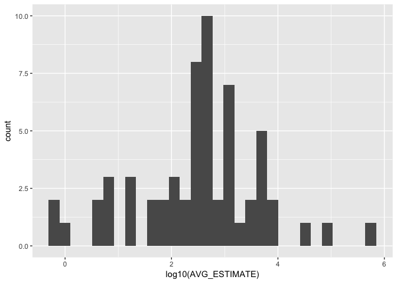
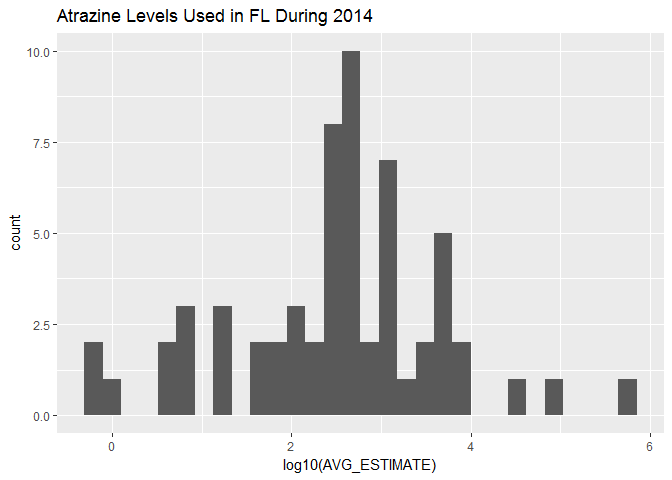
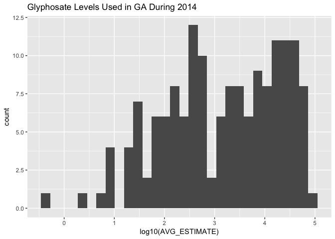
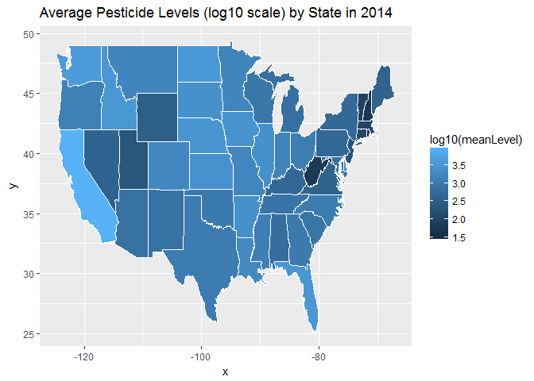

# N741: Lecture 7 Data and Code Wrangling
Vicki Hertzberg and Melinda Higgins  
February 17, 2017  

## Markdown Document Begins

Let's look at your "environment" at the beginning of the R Markdown document (RMD). One way to do this is to see what your current `sessionInfo()` is at first. Notice especially, what packages are NOT loaded.

Also let's see what the RMD file "sees" in your "Global Environment" - this question is itself incorrect, since when the "KNIT" process begins a new "environment" is actually created with an empty data space (no objects), which is why no packages beyond those in base R are available. We'll run the `ls()` command to "list" the objects that the RMD file can "see" along the steps below.


```r
sessionInfo()
```

```
## R version 3.3.2 (2016-10-31)
## Platform: x86_64-w64-mingw32/x64 (64-bit)
## Running under: Windows 10 x64 (build 14393)
## 
## locale:
## [1] LC_COLLATE=English_United States.1252 
## [2] LC_CTYPE=English_United States.1252   
## [3] LC_MONETARY=English_United States.1252
## [4] LC_NUMERIC=C                          
## [5] LC_TIME=English_United States.1252    
## 
## attached base packages:
## [1] stats     graphics  grDevices utils     datasets  methods   base     
## 
## loaded via a namespace (and not attached):
##  [1] backports_1.0.4 magrittr_1.5    rprojroot_1.1   tools_3.3.2    
##  [5] htmltools_0.3.5 yaml_2.1.14     Rcpp_0.12.8     stringi_1.1.2  
##  [9] rmarkdown_1.3   knitr_1.15.1    stringr_1.1.0   digest_0.6.10  
## [13] evaluate_0.10
```

```r
ls()
```

```
## character(0)
```

Notice that there are 4 parts to the `sessionInfo()` output:

* the R software version and platform details
* the "locale" information about English language and location in the United States
* a list of the "attached base packages" - these are the ones that are loaded with base R
* and a list of packages (so far) "loaded via namespace (and not attached)" to understand this better see this short demo at "Stack Overflow" [http://stackoverflow.com/questions/14988722/in-r-what-does-loaded-via-a-namespace-and-not-attached-mean](http://stackoverflow.com/questions/14988722/in-r-what-does-loaded-via-a-namespace-and-not-attached-mean). Basically, you can't call functions in these packages directly, instead you have to use the format `package::function()` to call the functions in these packages.

## Your RMD "Session" and "Environment"

Let's load the packages we need and run the `sessionInfo()` command again and compare to what we saw above. We'll run the `ls()` command again for completeness but we haven't created any objects yet so this is still empty.

Let's "load" `tidyverse` and see how this impacts the `sessionInfo()`.


```r
library(tidyverse)
```

```
## Loading tidyverse: ggplot2
## Loading tidyverse: tibble
## Loading tidyverse: tidyr
## Loading tidyverse: readr
## Loading tidyverse: purrr
## Loading tidyverse: dplyr
```

```
## Conflicts with tidy packages ----------------------------------------------
```

```
## filter(): dplyr, stats
## lag():    dplyr, stats
```

```r
sessionInfo()
```

```
## R version 3.3.2 (2016-10-31)
## Platform: x86_64-w64-mingw32/x64 (64-bit)
## Running under: Windows 10 x64 (build 14393)
## 
## locale:
## [1] LC_COLLATE=English_United States.1252 
## [2] LC_CTYPE=English_United States.1252   
## [3] LC_MONETARY=English_United States.1252
## [4] LC_NUMERIC=C                          
## [5] LC_TIME=English_United States.1252    
## 
## attached base packages:
## [1] stats     graphics  grDevices utils     datasets  methods   base     
## 
## other attached packages:
## [1] dplyr_0.5.0      purrr_0.2.2.9000 readr_1.0.0      tidyr_0.6.0     
## [5] tibble_1.2-12    ggplot2_2.2.0    tidyverse_1.0.0 
## 
## loaded via a namespace (and not attached):
##  [1] Rcpp_0.12.8      knitr_1.15.1     magrittr_1.5     munsell_0.4.3   
##  [5] colorspace_1.2-6 R6_2.1.3         stringr_1.1.0    plyr_1.8.4      
##  [9] tools_3.3.2      grid_3.3.2       gtable_0.2.0     DBI_0.5         
## [13] htmltools_0.3.5  yaml_2.1.14      lazyeval_0.2.0   rprojroot_1.1   
## [17] digest_0.6.10    assertthat_0.1   evaluate_0.10    rmarkdown_1.3   
## [21] stringi_1.1.2    scales_0.4.1     backports_1.0.4
```

```r
ls()
```

```
## character(0)
```

Now you get a 5th category in the `sessionInfo()` listing "other attached packages". So, you can now see that by loading `tidyverse` we have greatly expanded the functionality now available. `tidyverse` has now added:

* `dplyr`
* `purrr`
* `readr`
* `tidyr`
* `tibble`
* `ggplot`
* `tidyverse`

So, these packages (above) do not have to be loaded again.

However, `tidyverse` does load more packages by "namespace" but these (below) have to called using the `package::function()` syntax:

* `assertthat`
* `R6`
* `grid`
* `DBI`
* `gtable`
* `scales`
* `lazyeval`
* `munsell`
* `colorspace`

_NOTE: In general, it is a good idea to go ahead and use the `package::function()` syntax so that someone reading your code in the future will know at a glance what packages are needed for your code to work._

## Load Data

First let's read in the "Pesticides.csv" and "ag-dict.csv" datasets using `read_csv()` from the `readr` package loaded as part of the `tidyverse`. Notice that when we look at the Pesticides data using `head()` R says it is a "tibble" - this is also a result of using the `tidyverse`.

AND let's run `ls()` again so you see that we now have 2 objects in our "environment" that the RMD file can "see":

* `Pesticides` and
* `ag_dict`


```r
# read in the pesticide dataset
Pesticides <- read_csv("Pesticides.csv")
```

```
## Parsed with column specification:
## cols(
##   COMPOUND = col_character(),
##   YEAR = col_integer(),
##   STATE_CODE = col_integer(),
##   COUNTY_CODE = col_integer(),
##   LOW_ESTIMATE = col_double(),
##   HIGH_ESTIMATE = col_double()
## )
```

```r
# look at head() of dataset
# notice it is listed as a "tibble"
# this is from tidyverse
head(Pesticides)
```

```
## # A tibble: 6 × 6
##   COMPOUND  YEAR STATE_CODE COUNTY_CODE LOW_ESTIMATE HIGH_ESTIMATE
##      <chr> <int>      <int>       <int>        <dbl>         <dbl>
## 1    2_4_D  2014          1           1       1698.6        1885.5
## 2    2_4_D  2014          1           3       7513.6        8472.4
## 3    2_4_D  2014          1           5       2613.6        2889.4
## 4    2_4_D  2014          1           7       1259.2        1277.7
## 5    2_4_D  2014          1           9       7590.5        7756.1
## 6    2_4_D  2014          1          11       1318.9        1408.5
```

```r
# read in the links to county and state names
ag_dict <- read_csv("ag-dict.csv")
```

```
## Parsed with column specification:
## cols(
##   STATE_CODE = col_integer(),
##   COUNTY_CODE = col_integer(),
##   COUNTY = col_character(),
##   STATE = col_character()
## )
```

```r
ls()
```

```
## [1] "ag_dict"    "Pesticides"
```

## Summary of the Data

Let's run a `summary()` of the variables in the Pesticides dataset:


```r
summary(Pesticides)
```

```
##    COMPOUND              YEAR        STATE_CODE     COUNTY_CODE   
##  Length:392433      Min.   :2014   Min.   : 1.00   Min.   :  1.0  
##  Class :character   1st Qu.:2014   1st Qu.:19.00   1st Qu.: 35.0  
##  Mode  :character   Median :2014   Median :29.00   Median : 77.0  
##                     Mean   :2014   Mean   :30.73   Mean   : 94.6  
##                     3rd Qu.:2014   3rd Qu.:45.00   3rd Qu.:129.0  
##                     Max.   :2014   Max.   :56.00   Max.   :810.0  
##                                                                   
##   LOW_ESTIMATE     HIGH_ESTIMATE    
##  Min.   :      0   Min.   :      0  
##  1st Qu.:      1   1st Qu.:      2  
##  Median :     12   Median :     16  
##  Mean   :   1534   Mean   :   1225  
##  3rd Qu.:    134   3rd Qu.:    142  
##  Max.   :5507146   Max.   :5507146  
##  NA's   :119027
```

This dataset is estimated amounts of different pesticides (388 compounds) applied **by county** and **by state** in 2014. 

## Compute a new variable

The variables LOW_ESTIMATE and HIGH_ESTIMATE are estimated amounts of the pesticide named in that row applied in that county of that state in 2014. Let's **create a new variable**, the average estimate and get a summary.


```r
Pesticides$AVG_ESTIMATE <- 
  (Pesticides$LOW_ESTIMATE + Pesticides$HIGH_ESTIMATE)/2

summary(Pesticides$AVG_ESTIMATE)
```

```
##    Min. 1st Qu.  Median    Mean 3rd Qu.    Max.    NA's 
##       0       2      22    1598     190 5507000  119027
```

## The "Grammar" of Data Wrangling

The Girasoles (Sunflower) study is assessing the health of agricultural workers in Florida (STATE_CODE 12). The cities where we have worked to date are Pierson, Apopka, Immokalee, and Felsmere, which are located in Volusia, Orange, Collier, and Indian River Counties respectively. The county codes are 127, 945, 21, and 61 respectively. 

Today we are talking a bit more about the `grammars` of R, specifically, the grammar of graphics, and the grammar of data wrangling.

That brilliant rascal, Hadley Wickham, is responsible for both of these grammars. 

First, the grammar of data wrangling (or More with `dplyr` from `tidyverse`).

There are five "verbs" for data wrangling. These are as follows:

- `select()` 
    + This will take a subset of columns (i.e., features or variables)
- `filter()`
    + This will take a subset of rows (i.e., observations)
- `mutate()`
    + This will add or modify existing columns
- `arrange()`
    + This will sort the rows
- `summarize()` 
    + This will aggregate data across rows (e.g., group it according to some criteria)

Each of these functions takes a data frame as its first argument, and returns a data frame. So these are pretty powerful functions, allowing you to slice and dice your way through a data table. 

It is said that Hadley Wickham created these "verbs" in an inspiration to blur the boundaries between R and SQL, a relational database querying language. 

## Subsetting data - selecting the columns or rows you want

The two simplest of these commands are `select()` and `filter()`. These allow you to return only a subset of columns or rows in a data frame. 

To demonstrate, let's grab the chunk of the dataset that is only the pesticide Atrazine applied in the state of Florida. We already know that Florida has STATE_CODE of 12, so first let's just grab the columns we want, COMPOUND, STATE_CODE, and AVG_ESTIMATE (i.e. keep 3 columns). We can use the `dim()` command to get the number of rows and columns for each new data object created.


```r
# dplyr::select() selects columns you want to keep
pesticide_subset <- select(Pesticides, 
                           COMPOUND, 
                           STATE_CODE, 
                           AVG_ESTIMATE)
dim(pesticide_subset)
```

```
## [1] 392433      3
```

Now let's get Florida only (keep only the rows for Florida):


```r
# dplyr::filter() selects the rows you want
# notice we are using a LOGICAL argument
# STATE_CODE == 12 as our filter
FL_subset <- filter(pesticide_subset, 
                    STATE_CODE == 12)
dim(FL_subset)
```

```
## [1] 9167    3
```

And now let's get Atrazine only rows:


```r
FL_Atrazine <- filter(FL_subset, 
                      COMPOUND == "Atrazine")
dim(FL_Atrazine)
```

```
## [1] 60  3
```

## EXERCISE FOR YOU TO TRY

Why don't you try this with data from the state of Georgia (with state code 13)? Specifically, the governor is interested in the amount of glyphosate (aka "Round-up") applied in 2014. How would you do this? Fill in the following R chunk. In this case, look for COMPOUND with name "Glyphosate" with a capital "G".


```r
# TRY IN CLASS
```

## A better way - Using pipes `%>%`

Note that in the way that we have sequenced these operations, the `filter()` operation is *nested* within the `select()` operation. We could just as easily reversed the order, nesting `select()` within `filter()`. Another way to think of this maneuver is that these operations are "chained" together in a "pipeline". The symbol for "piping"is `%>%`, in which the value returned from the first operation is the input for the second operation, etc.

For instance, instead of 3 different steps above, we can do this in effectively one line of code as follows shown below. This can be read as "take the Pesticides dataset" THEN select 3 variables (columns) THEN filter out only the cases (rows) for Florida (STATE_CODE=12) and Atrazine (COMPOUND).


```r
FL_Atrazine_new <- Pesticides %>% 
  select(COMPOUND, STATE_CODE, AVG_ESTIMATE) %>%
  filter(STATE_CODE == 12 & COMPOUND == "Atrazine")

# run summary of this data
summary(FL_Atrazine_new$AVG_ESTIMATE)
```

```
##     Min.  1st Qu.   Median     Mean  3rd Qu.     Max. 
##      0.5     84.2    399.6  10700.0   1164.0 447100.0
```
 
## Let's make a histogram of Atrazine Use in FL in 2014

Let's make a histogram of the Atrazine Use in FL during 2014. 

As we make this plot - we'll walk through the "Grammar of Graphics" `ggplot2` syntax and layering approach to building a plot/graphic.

### Step 1 - initialize the graphical environment


```r
ggplot(data=FL_Atrazine_new)
```

<!-- -->

### Step 2 - add a "geom" geometric object for histogram

As we saw looking at the summary stats above, the data is really skewed with some possible outliers (really high levels). So, we'll use a `log10()` transform of the data to help "normalize" the levels. NOTE: The minimum value was small but was > 0. Remember log(0) is not a number so if you have true 0's in your data do not use a log-transform.


```r
ggplot(data=FL_Atrazine_new) +
  geom_histogram(aes(log10(AVG_ESTIMATE)))
```

```
## `stat_bin()` using `bins = 30`. Pick better value with `binwidth`.
```

<!-- -->

### Step 3 - add a title


```r
ggplot(data=FL_Atrazine_new) +
  geom_histogram(aes(log10(AVG_ESTIMATE))) +
  ggtitle("Atrazine Levels Used in FL During 2014")
```

```
## `stat_bin()` using `bins = 30`. Pick better value with `binwidth`.
```

<!-- -->

```r
# we could also do this using pipes %>%
FL_Atrazine_new %>%
  ggplot() + 
  geom_histogram(aes(log10(AVG_ESTIMATE))) +
  ggtitle("Atrazine Levels Used in FL During 2014")
```

```
## `stat_bin()` using `bins = 30`. Pick better value with `binwidth`.
```

<!-- -->

### Suppose we put it all into 1 long process

Most of the above code could be condensed using pipes `%>%`. The biggest advantage is you can easily see how we started with the original Pesticides dataset, selected variables of interest, filtered out the rows we wanted, and then made a histogram using the `ggplot2` approach.


```r
# we could actually do all of the 
# multiple code steps above using pipes %>%

Pesticides %>% 
  select(COMPOUND, STATE_CODE, AVG_ESTIMATE) %>%
  filter(STATE_CODE == 12 & COMPOUND == "Atrazine") %>%
  ggplot() + 
  geom_histogram(aes(log10(AVG_ESTIMATE))) +
  ggtitle("Atrazine Levels Used in FL During 2014")
```

```
## `stat_bin()` using `bins = 30`. Pick better value with `binwidth`.
```

<!-- -->

## EXERCISE FOR YOU TO TRY 
 
Let's modify the code above for Georgia's (STATE_CODE 13) use of Glyphosate (remember to captialize the "G") - show the histogram.


```r
Pesticides %>% 
  select(COMPOUND, STATE_CODE, AVG_ESTIMATE) %>%
  filter(STATE_CODE == 13 & COMPOUND == "Glyphosate") %>%
  ggplot() + 
  geom_histogram(aes(log10(AVG_ESTIMATE))) +
  ggtitle("Glyphosate Levels Used in GA During 2014")
```

```
## `stat_bin()` using `bins = 30`. Pick better value with `binwidth`.
```

```
## Warning: Removed 2 rows containing non-finite values (stat_bin).
```

<!-- -->

## Modifying the data object - `rename` and `mutate`

The `mutate()` and `rename()` functions allow us to cerate, redefine, and rename our variables. 

When we created the new variable AVG_ESTIMATE above, we could have used `mutate()` to create and append a new variable to the Pesticides dataset (thus "mutating" it from its original form).


```r
# the option is to do this with the
# dplyr package mutate() function
# and the %>% "pipe" option also available
# in the dplyr package which imports
# the magrittr package
Pesticides <- Pesticides %>%
  mutate(AVG_ESTIMATE = (LOW_ESTIMATE+HIGH_ESTIMATE)/2)
         
summary(Pesticides)  
```

```
##    COMPOUND              YEAR        STATE_CODE     COUNTY_CODE   
##  Length:392433      Min.   :2014   Min.   : 1.00   Min.   :  1.0  
##  Class :character   1st Qu.:2014   1st Qu.:19.00   1st Qu.: 35.0  
##  Mode  :character   Median :2014   Median :29.00   Median : 77.0  
##                     Mean   :2014   Mean   :30.73   Mean   : 94.6  
##                     3rd Qu.:2014   3rd Qu.:45.00   3rd Qu.:129.0  
##                     Max.   :2014   Max.   :56.00   Max.   :810.0  
##                                                                   
##   LOW_ESTIMATE     HIGH_ESTIMATE      AVG_ESTIMATE    
##  Min.   :      0   Min.   :      0   Min.   :      0  
##  1st Qu.:      1   1st Qu.:      2   1st Qu.:      2  
##  Median :     12   Median :     16   Median :     22  
##  Mean   :   1534   Mean   :   1225   Mean   :   1598  
##  3rd Qu.:    134   3rd Qu.:    142   3rd Qu.:    190  
##  Max.   :5507146   Max.   :5507146   Max.   :5507146  
##  NA's   :119027                      NA's   :119027
```

Suppose we wanted to rename this newly created variable from "AVG_ESTIMATE" to "avgEst", we could use `rename()` to change the name. We'll then run the `names()` command to see the new list of variable names for the Pesticides dataset.


```r
Pesticides <- Pesticides %>%
  rename(avgEst = AVG_ESTIMATE)

names(Pesticides)
```

```
## [1] "COMPOUND"      "YEAR"          "STATE_CODE"    "COUNTY_CODE"  
## [5] "LOW_ESTIMATE"  "HIGH_ESTIMATE" "avgEst"
```

## Methods for summarising the data - `summarise` and `group_by`

Next let's use the `group_by()` and `summarise()` commands from the `dplyr` package. Let's look at the mean "avgEst" from each state.


```r
stateLevels <- Pesticides %>%
  group_by(STATE_CODE) %>%
  summarise(meanLevel = mean(avgEst, na.rm=TRUE))

# get some details on new stateLevels data object
dim(stateLevels)
```

```
## [1] 48  2
```

```r
names(stateLevels)
```

```
## [1] "STATE_CODE" "meanLevel"
```

```r
head(stateLevels)
```

```
## # A tibble: 6 × 2
##   STATE_CODE meanLevel
##        <int>     <dbl>
## 1          1  616.7813
## 2          4  733.0102
## 3          5 2530.4443
## 4          6 8810.5637
## 5          8 1777.0288
## 6          9  107.4497
```

**NOTE:** This newly created object `stateLevels` is a nice neat "data.frame" object (run `class(stateLevels)` to check). Guess what - `knitr::kable()` works well on these kinds of objects so we can use this to make a table. 

The `dim()` command shows us that we have 2 columns with names "STATE_CODE" and "meanLevel" for 48 states. IN the code below we'll clean up these column names and give the table a "caption". We'll clean this up further below by finding a way to match the names of the States to their Codes so we can use actual State names instead of just numeric codes.

To minimize the length of the table, we'll just include the 1st 10 rows.


```r
knitr::kable(x = stateLevels[1:10,],
             col.names = c("State Codes",
                           "Avg Pesticide Level"),
             caption = "Average Pesticide Levels by State")
```


Table: Average Pesticide Levels by State

 State Codes   Avg Pesticide Level
------------  --------------------
           1              616.7813
           4              733.0102
           5             2530.4443
           6             8810.5637
           8             1777.0288
           9              107.4497
          10             2639.3789
          12             3204.2359
          13             1002.0889
          16             3152.6404

## Use JOIN commands - add State Abbreviations and Names

In the `stateLevels` data object, so far all we have are numeric codes for the states but we'd like to add either the State abbreviations or the State names or both.

1. We're going to add information on the states from a built in dataset `state.regions` from the `choroplethrMaps` package. 
2. Then we rename `STATE_CODE` to `fips.numeric` to match with what is in the `state.regions` data object.
3. Then we can "merge" the 2 data objects together using a JOIN. There are multiple ways to do a JOIN - to learn more see [http://stat545.com/bit001_dplyr-cheatsheet.html](http://stat545.com/bit001_dplyr-cheatsheet.html). For what we're wanting here, we'll do a LEFT JOIN to keep the data in our original `stateLevels` data object and only add the rows from `state.regions` that match up and ignore (not merge in) anything in `state.regions` that doesn't match up.


```r
# load choroplethrMaps package
library(choroplethrMaps)

# get state names to go with the FIPS codes
# use data() function to load the data we
# want into the environment
data(state.regions)

# look at top of state.regions dataset
head(state.regions)
```

```
##       region abb fips.numeric fips.character
## 1     alaska  AK            2             02
## 2    alabama  AL            1             01
## 3   arkansas  AR            5             05
## 4    arizona  AZ            4             04
## 5 california  CA            6             06
## 6   colorado  CO            8             08
```

```r
# rename STATE_CODE to match fips.numeric in
# the state.regions data object
stateLevels <- stateLevels %>%
  rename(fips.numeric = STATE_CODE)

head(stateLevels)
```

```
## # A tibble: 6 × 2
##   fips.numeric meanLevel
##          <int>     <dbl>
## 1            1  616.7813
## 2            4  733.0102
## 3            5 2530.4443
## 4            6 8810.5637
## 5            8 1777.0288
## 6            9  107.4497
```

```r
# next let's merge (JOIN) this with our stateLevels
stateLevels2 <- left_join(stateLevels, 
                           state.regions,
                           by="fips.numeric")

head(stateLevels2)
```

```
## # A tibble: 6 × 5
##   fips.numeric meanLevel      region   abb fips.character
##          <int>     <dbl>       <chr> <chr>          <chr>
## 1            1  616.7813     alabama    AL             01
## 2            4  733.0102     arizona    AZ             04
## 3            5 2530.4443    arkansas    AR             05
## 4            6 8810.5637  california    CA             06
## 5            8 1777.0288    colorado    CO             08
## 6            9  107.4497 connecticut    CT             09
```

## Arranging (sorting) data and making a better table.

Another great verb from `dplyr` is `arrange()` which can be used to sort the dataset by the values in selected variables.

Let's make the table again using the State Names instead of the codes - but first we'll sort the dataset and print the table for the top 10.


```r
stateLevels2 %>%
  arrange(desc(meanLevel)) %>%
  head()
```

```
## # A tibble: 6 × 5
##   fips.numeric meanLevel       region   abb fips.character
##          <int>     <dbl>        <chr> <chr>          <chr>
## 1            6  8810.564   california    CA             06
## 2           53  3669.994   washington    WA             53
## 3           38  3460.586 north dakota    ND             38
## 4           12  3204.236      florida    FL             12
## 5           16  3152.640        idaho    ID             16
## 6           31  2937.926     nebraska    NE             31
```

Using this approach, we'll append the `knitr::kable()` commands and make an updated table. We select the top 10 rows after the `arrange()` command by using the `slice()` command.


```r
stateLevels2 %>%
  arrange(desc(meanLevel)) %>%
  select(region, meanLevel) %>%
  slice(1:10) %>%
  knitr::kable(col.names = c("State",
                             "Avg Pesticide Level"),
               caption = "Average Pesticide Levels - Top 10 States")
```


Table: Average Pesticide Levels - Top 10 States

State           Avg Pesticide Level
-------------  --------------------
california                 8810.564
washington                 3669.994
north dakota               3460.586
florida                    3204.236
idaho                      3152.640
nebraska                   2937.926
iowa                       2747.428
kansas                     2667.786
delaware                   2639.379
south dakota               2547.502

## Let's make a map of the Pesticide Levels by State

Now that we have the State abbreviations and names merged with the average pesticide levels, we can use these values to make a "Chlorpleth Map" where each State is colored according to the variable level we specify (in this case the average pesticide levels).


```r
# to make a map of the US with ggplot2
# we need the map_data("state")
states_map <- ggplot2::map_data("state")
```

```
## 
## Attaching package: 'maps'
```

```
## The following object is masked from 'package:purrr':
## 
##     map
```

```r
# ggplot layers to make the map
ggplot(stateLevels2, aes(map_id = region)) +
  geom_map(aes(fill = log10(meanLevel)),
           map = states_map,
           colour="white") +
  expand_limits(x = states_map$long, 
                y = states_map$lat) +
  ggtitle("Average Pesticide Levels (log10 scale) by State in 2014 ")
```

<!-- -->

## Nested Data Structures

Many datasets have more than 1 measure for each "case or subject" in the dataset - in other words, the measurements are nested within the subjects (cases). Not only do we have more than 1 measurement per subject, we often take these measurements at multiple times (time nested within measurements nested within subjects). Sometimes the subjects themselves are nested within higher "structures" we are interested in - such as subjects living within households or students in a classroom and those households are then nested within neighborhoods or classrooms within schools - or patients within units within hospitals, and so on... The possibilities are limitless.

Thus, even we have "tidy" data, we want to change it around and restructure it so that we can access the data at the level we want. Often the level of measurement may change - for example, sometimes we may be interested in the patients as the level of outcome of interest and othertimes we're interested in the hospital units as the level of interest.

### The nested (or hierarchical) structure of the Pesticide Data

This Pesticide dataset is a very "long" (or "tall") dataset since this is a 3-level "nested" dataset where the 388 pesticide chemical measurements are "nested" -> within counties which are "nested" -> within states (which is within the United States).

### Example Nested Data Structure - `DiagrammeR` Graphic

The figure below was generated using a cool package called `DiagrammeR`, which you can learn more about at [http://rich-iannone.github.io/DiagrammeR/index.html](http://rich-iannone.github.io/DiagrammeR/index.html). The RED circles represent states (S1, S2, S3, ...); the GREEN circles represent the counties (c1, c2, c3, ...) and the ORANGE circles represent the pesticides (p1, p2, p3, ...).

<!--html_preserve--><div id="htmlwidget-4e3ec8f50f40c3aa55f9" style="width:672px;height:480px;" class="grViz html-widget"></div>
<script type="application/json" data-for="htmlwidget-4e3ec8f50f40c3aa55f9">{"x":{"diagram":"\n      digraph dot {\n      \n      graph [layout = dot]\n      \n      node [shape = circle,\n      style = filled,\n      color = grey]\n      \n      node [fillcolor = red]\n      S1 S2 S3\n      \n      node [fillcolor = green]\n      c1 c2 c3 c4 c5 c6 c7 c8\n      \n      node [fillcolor = orange]\n      \n      edge [color = grey]\n      S1 -> {c1 c2}\n      S2 -> {c3 c4 c5}\n      S3 -> {c6 c7 c8}\n      c1 -> {p1 p2 p3 p4}\n      c2 -> {p1 p2 p3 p4}\n      c3 -> {p1 p2 p3 p4}\n      c4 -> {p1 p2 p3 p4}\n      c5 -> {p1 p2 p3 p4}\n      c6 -> {p1 p2 p3 p4}\n      c7 -> {p1 p2 p3 p4}\n      c8 -> {p1 p2 p3 p4}\n      }","config":{"engine":"dot","options":null}},"evals":[],"jsHooks":[]}</script><!--/html_preserve-->

### Another fun graph to visualize this

The varying grey-shaded nodes represent the different pesticides.

<!--html_preserve--><div id="htmlwidget-f0c12d25198b963cffce" style="width:672px;height:480px;" class="grViz html-widget"></div>
<script type="application/json" data-for="htmlwidget-f0c12d25198b963cffce">{"x":{"diagram":"\n      digraph neato {\n      \n      graph [layout = neato]\n      \n      node [shape = circle,\n      style = filled,\n      color = grey]\n      \n      node [fillcolor = red]\n      US\n      \n      node [fillcolor = green]\n      S1 S2 S3\n      \n      node [fillcolor = orange]\n      c1 c2 c3 c4 c5 c6 c7 c8 c9\n\n      node [fillcolor = grey41, label = \"\"]\n      p1 p6 p11 p16 p21 p26 p31 p36 p41\n\n      node [fillcolor = grey51, label = \"\"]\n      p2 p7 p12 p17 p22 p27 p32 p37 p42\n\n      node [fillcolor = grey61, label = \"\"]\n      p3 p8 p13 p18 p23 p28 p33 p38 p43\n\n      node [fillcolor = grey71, label = \"\"]\n      p4 p9 p14 p19 p24 p29 p34 p39 p44\n\n      node [fillcolor = grey81, label = \"\"]\n      p5 p10 p15 p20 p25 p30 p35 p40 p45\n\n      edge [color = grey]\n      US -> {S1 S2 S3}\n      S1 -> {c1 c2 c3}\n      S2 -> {c4 c5 c6}\n      S3 -> {c7 c8 c9}\n      c1 -> {p1 p2 p3 p4 p5}\n      c2 -> {p6 p7 p8 p9 p10}\n      c3 -> {p11 p12 p13 p14 p15}\n      c4 -> {p16 p17 p18 p19 p20}\n      c5 -> {p21 p22 p23 p24 p25}\n      c6 -> {p26 p27 p28 p29 p30}\n      c7 -> {p31 p32 p33 p34 p35}\n      c8 -> {p36 p37 p38 p39 p40}\n      c9 -> {p41 p42 p43 p44 p45}\n      }","config":{"engine":"dot","options":null}},"evals":[],"jsHooks":[]}</script><!--/html_preserve-->

## Restructure Pesticides Data from "long" to "wide"

The primary functions we will explore here are `spread()` and `gather()` from the `tidyr` package.

So, what if wanted the 388 pesticides to each have their own column (i.e. separate variables for each pesticide level). In this case we are moving pesticide level from a row in the "avgEst" average estimate into it's own column.

We want to `spread()` the pesticides from rows out into columns - thus making the dataset "wider". To make this easier to see, let's just focus on Florida (STATE_CODE = 12) and let's just look at 3 pesticides: "Atrazine", "Glyphosate", and "Malathion".

This newly created dataset should have the number of rows equal to the counties who used Atrazine or Glyphosate or Malathion. The `sum()` statements below count the number of TRUE values for each condition. Check this again the `dim()` rows for the final dataset as a quick check. [The answer is 60 + 67 + 64 = 191.] Also, we will only keep the COMPOUND, COUNTY_CODE, and avgEst.


```r
# number of Florida Counties who used Atrazine
sum(FL_subset$COMPOUND == "Atrazine")
```

```
## [1] 60
```

```r
# number of Florida Counties who used Glyphosate
sum(FL_subset$COMPOUND == "Glyphosate")
```

```
## [1] 67
```

```r
# number of Florida Counties who used Malathion
sum(FL_subset$COMPOUND == "Malathion")
```

```
## [1] 64
```

```r
FL_3pest <- Pesticides %>%
  filter(STATE_CODE == 12) %>%
  filter(COMPOUND %in% c("Atrazine",
                         "Glyphosate",
                         "Malathion")) %>%
  select(COMPOUND, 
         COUNTY_CODE, 
         avgEst)

dim(FL_3pest)
```

```
## [1] 191   3
```

```r
head(FL_3pest)
```

```
## # A tibble: 6 × 3
##   COMPOUND COUNTY_CODE avgEst
##      <chr>       <int>  <dbl>
## 1 Atrazine           1 3952.9
## 2 Atrazine           3  166.2
## 3 Atrazine           5    4.4
## 4 Atrazine           7  495.3
## 5 Atrazine           9  333.4
## 6 Atrazine          13  749.5
```

Next let's `spread` this dataset out. YOu need to specify the `key` which is what is being spread out - in this case the `COMPOUND` and you need to specify which variable is being moved - in this case the `value` is `avgEst` the average pesticide level (we are NOT moving the LOW_ESTIMATE and HIGH_ESTIMATE).


```r
FL_3pest_wide <- FL_3pest %>%
  spread(key = COMPOUND,
         value = avgEst)

dim(FL_3pest_wide)
```

```
## [1] 67  4
```

```r
head(FL_3pest_wide)
```

```
## # A tibble: 6 × 4
##   COUNTY_CODE Atrazine Glyphosate Malathion
##         <int>    <dbl>      <dbl>     <dbl>
## 1           1   3952.9    6189.25      31.4
## 2           3    166.2     309.55       3.0
## 3           5      4.4      23.85       1.0
## 4           7    495.3     519.00       4.7
## 5           9    333.4    4398.20     159.5
## 6          11       NA     156.70       0.7
```

We went from 191 rows and 3 columns (`FL_3pest`) with 1 row per county and pesticide compound to 67 rows and 4 columns (`FL_3pest_wide`) with 1 row per county and 1 column for each of the 3 compounds. NOTICE that we LOST the variables `COMPOUND` and `avgEst`. This new dataset is NOT tidy, but that is ok.

## Let's go back from "wide" to "long"

To go back to what we had before and go from a "wide" structure to a "long" structure, we can use the `gather()` function in the `tidy` package. This time the `key` is the new variable we're creating from the columns we're collapsing into rows. The `value` is the new variable we want to name the values were collecting (i.e. `avgEst`). Then we have to list the column variables were collapsing - in this case the names of the 3 compounds.

NOTE: You'll notice when we run the `dim()` command we end up with 201 rows which is more than the 191 we started with originally. This is because not every pesticide was used/measured in every county. So, there are now MISSING (NAs) for the counties in which that particular pesticide was not measured or reported.


```r
FL_3pest_long <- FL_3pest_wide %>%
  gather(key = COMPOUND,
         value = avgEst,
         Atrazine,  
         Glyphosate,
         Malathion)

dim(FL_3pest_long)
```

```
## [1] 201   3
```

```r
head(FL_3pest_long)
```

```
## # A tibble: 6 × 3
##   COUNTY_CODE COMPOUND avgEst
##         <int>    <chr>  <dbl>
## 1           1 Atrazine 3952.9
## 2           3 Atrazine  166.2
## 3           5 Atrazine    4.4
## 4           7 Atrazine  495.3
## 5           9 Atrazine  333.4
## 6          11 Atrazine     NA
```

## Check environment again at end

Run `sessionInfo()` and `ls()` again to check your current session environment and objects loaded.


```r
sessionInfo()
```

```
## R version 3.3.2 (2016-10-31)
## Platform: x86_64-w64-mingw32/x64 (64-bit)
## Running under: Windows 10 x64 (build 14393)
## 
## locale:
## [1] LC_COLLATE=English_United States.1252 
## [2] LC_CTYPE=English_United States.1252   
## [3] LC_MONETARY=English_United States.1252
## [4] LC_NUMERIC=C                          
## [5] LC_TIME=English_United States.1252    
## 
## attached base packages:
## [1] stats     graphics  grDevices utils     datasets  methods   base     
## 
## other attached packages:
##  [1] DiagrammeR_0.9.0    maps_3.1.1          choroplethrMaps_1.0
##  [4] dplyr_0.5.0         purrr_0.2.2.9000    readr_1.0.0        
##  [7] tidyr_0.6.0         tibble_1.2-12       ggplot2_2.2.0      
## [10] tidyverse_1.0.0    
## 
## loaded via a namespace (and not attached):
##  [1] Rcpp_0.12.8        RColorBrewer_1.1-2 influenceR_0.1.0  
##  [4] plyr_1.8.4         highr_0.6          viridis_0.3.4     
##  [7] tools_3.3.2        digest_0.6.10      jsonlite_1.1      
## [10] evaluate_0.10      gtable_0.2.0       rgexf_0.15.3      
## [13] igraph_1.0.1       rstudioapi_0.6     DBI_0.5           
## [16] yaml_2.1.14        gridExtra_2.2.1    stringr_1.1.0     
## [19] knitr_1.15.1       htmlwidgets_0.8    rprojroot_1.1     
## [22] grid_3.3.2         R6_2.1.3           Rook_1.1-1        
## [25] XML_3.98-1.4       rmarkdown_1.3      magrittr_1.5      
## [28] backports_1.0.4    scales_0.4.1       htmltools_0.3.5   
## [31] assertthat_0.1     colorspace_1.2-6   brew_1.0-6        
## [34] labeling_0.3       stringi_1.1.2      visNetwork_1.0.3  
## [37] lazyeval_0.2.0     munsell_0.4.3
```

```r
ls()
```

```
##  [1] "ag_dict"          "FL_3pest"         "FL_3pest_long"   
##  [4] "FL_3pest_wide"    "FL_Atrazine"      "FL_Atrazine_new" 
##  [7] "FL_subset"        "pesticide_subset" "Pesticides"      
## [10] "state.regions"    "stateLevels"      "stateLevels2"    
## [13] "states_map"
```

